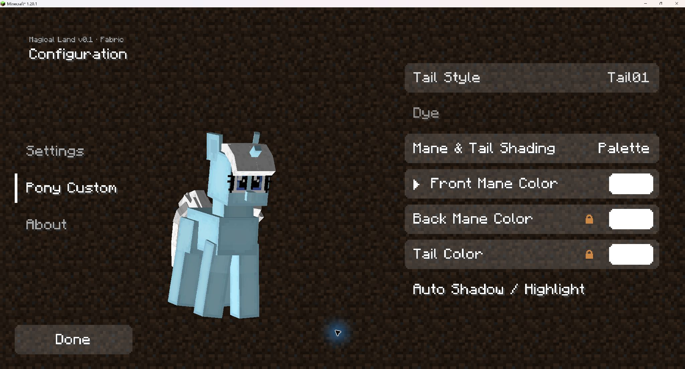
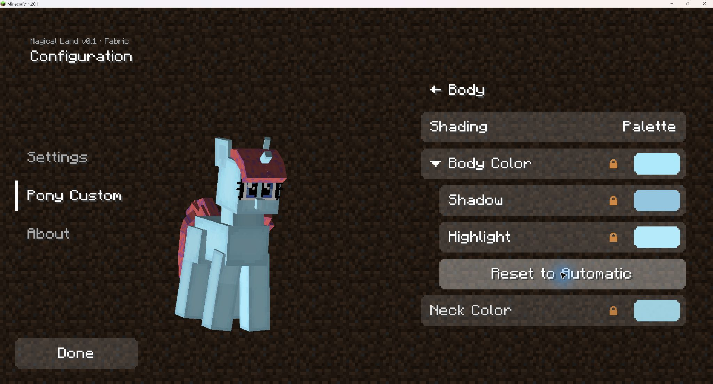
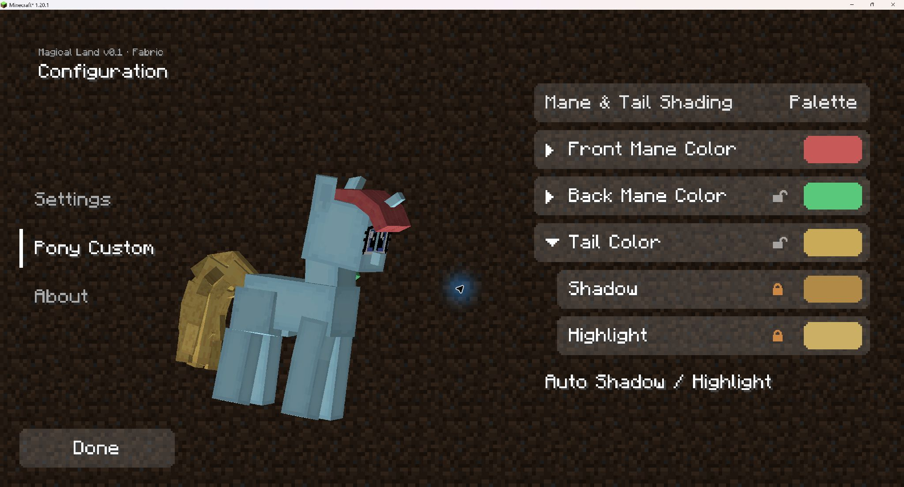

# 颜色二级菜单：游戏验收

2026-09-08，按作者授权启动隔离客户端验收，通过后推送。本轮检查捏马界面及配色功能，不重复完整光线、姿势或模型审查。

## 已验证

- 身体、前发进入页面时默认收起；后发、尾巴锁定联动时不显示独立色阶入口，解锁后出现小三角。
- 小三角仅切换子菜单，色块仍打开取色器，锁仍控制联动或自动色阶；子项缩进、标签与色块/锁之间没有观察到重叠。
- 滚动到鬃毛颜色区后展开、解锁、恢复自动不再返回页首。收起或切换传统模式使列表变短时，滚动限制在有效范围内，没有持续回弹或留下空白列表。
- 在身体行使用鼠标展开，再按 Enter 收起、空格重新展开，屏幕重建后焦点仍可连续使用。
- 前发主色改为红色后，仍联动的后发、尾巴和自动色阶同步更新，身体不变。手动前发阴影改为紫色后，实际三维预览立即响应。
- 身体高光解锁后可手调；收起菜单不丢失手选高光。身体切到传统乘色再回到色阶时，手选值恢复生效；“恢复自动”恢复身体色阶，不重置鬃毛配色。
- 后发解锁继承当前外观和手动阴影；改成绿色不覆盖前发或尾巴。尾巴解锁改为金色后，三处主色各自独立；尾巴展开后显示其自己的阴影、高光。
- 鬃毛页“恢复自动”使三处色阶自动计算，但不合并独立主色。后发重新联动时恢复跟随前发，尾巴仍独立；传统乘色/色阶模式来回切换保留独立主色和同页展开状态。
- 在后续客户端重启中，先前的前发手动阴影、身体手动高光正确加载；重新进入页面默认收起。预览旋转正常。

所有明显偏色均是区分功能的临时测试色，不是新的美术配色。

## 截图

默认仅显示主色行：

身体子菜单和恢复自动按钮：

尾巴独立金色，展开其自动阴影、高光：

## 环境、限制与收尾

- Minecraft 1.20.1 / Fabric / GeckoLib 4.8.3，已有离线依赖，Java 25.0.4。共运行三次客户端，均正常关闭并返回 `BUILD SUCCESSFUL`；未制作发布 JAR。
- 中间一轮只在隔离副本临时记录键盘事件：远程输入的 Left 到达游戏时为未知键值 `-1`，不是正常的方向键 `263`。控件有焦点且收到事件，未因此修改配色或扩大为输入系统重构。最终版补充 Enter/空格并完成真实键盘操作验收；左右键对应的正确键值通过隔离测试，但受远程输入限制，未计为真实按键通过项。
- 诊断代码已移除，未进入正式源码或提交。最终客户端的 71 个源码/资源/构建配置文件与正式候选版本逐文件核对。6 个改动 Java 文件独立类型检查及 5,063 项隔离断言通过。
- 未出现新增调色回退或异常；原有离线 Realms 授权提示、Java/LWJGL 与资源警告未作为本轮新增问题。未遍历全部语言/GUI 缩放、短列表布局、联机或光照动画矩阵；本轮操作均在真实客户端捏马界面，未重测世界中的第三人称渲染。
- 游戏退出后将隔离测试模型配置及 `options.txt` 恢复为测试前的原文件，保持原音量，不修改正式玩家存档。
- 原始日志、配置快照及备份留在本地 `Resources/PolishLab_20260907/19_color_submenus_runtime/`；仅功能代码、中英文文本和验收文档/截图进入提交。
