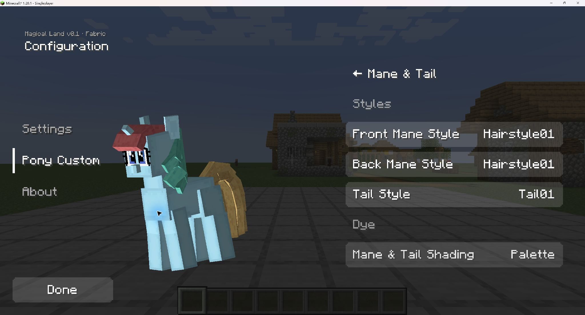
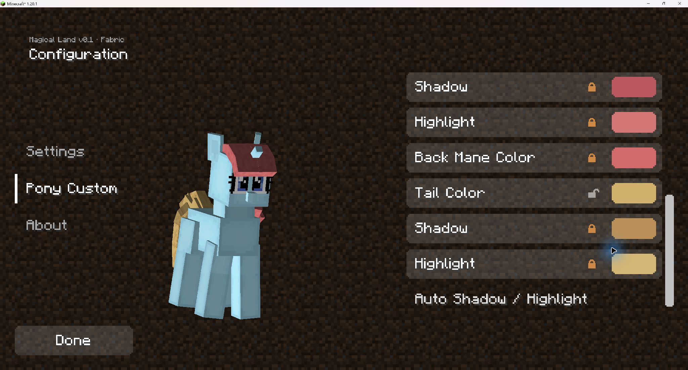

# 鬃毛与尾巴调色：游戏验收

2026-09-07，按作者要求只检查调色功能，不重复完整光照或动作矩阵。结论：本轮调色功能通过，可以推送正式资源与代码。

## 环境与范围

隔离测试副本，Minecraft 1.20.1 / Fabric / GeckoLib 4.8.3，Java 25.0.4。测试副本的 71 个源文件、资源及构建配置与正式仓库逐文件核对；使用已有离线依赖运行 `runClient`，两次均正常退出、任务成功。未制作发布 JAR，未修改正式玩家存档。

## 已验证

- 在已有测试世界打开外观界面，从原白色配置开始，前发改为 `#D16B6B` 后，后发、尾巴同时变色，自动阴影和高光同步变化，身体颜色保持不变。
- 分别解锁前发阴影、高光并选择明显不同的测试色（紫色阴影 `#7758BA`、偏黄高光 `#D1D376`），确认色阶作用于实际模型，也同步到仍联动的后发和尾巴。测试色仅用于区分功能，不是建议的美术配色。
- 解锁后发、尾巴时保留当时可见配色和手动色阶；随后后发改为 `#6BD1BA`、尾巴改为 `#D1B06B`，三处主色互不覆盖。
- 点击“高光/阴影恢复自动”后，三处各自恢复自动色阶，独立主色与部位解锁状态不被合并。
- 后发重新锁定后立即恢复跟随前发，尾巴仍保持独立金色。
- 返回第三人称游戏画面，玩家实际模型正确显示红色鬃毛和金色尾巴，不仅是设置页色块变化。
- 正常关闭客户端后重新启动，后发联动锁、尾巴独立状态、已保存颜色与自动色阶均正确加载；检查完正常退出。
- 未出现 `Body palette unavailable` / `Mane palette unavailable` 调色回退日志，也无新增调色异常。原有 GeckoLib 几何版本、Java/LWJGL 及离线 Realms 提示仍存在，不作为本次新增问题。

## 验收截图

三处独立主色，分别使用自动阴影和高光：

重启后仍保持后发联动、尾巴独立，色阶锁状态正确：

## 非阻塞事项与未测范围

切换锁后列表回到顶部，已写入根目录 `TODO.md`；不影响配色与保存，本次不扩大为界面重构。未重测多种光照/所有姿势，也未验证双客户端联机、Java 17 运行时或其他渲染器。资源热重载不计入本轮通过项。

历史实验草案、原文件备份和完整原始日志继续留在本地 `Resources/PolishLab_20260907/` 与任务测试输出目录，不作为正式模型资源发布。
